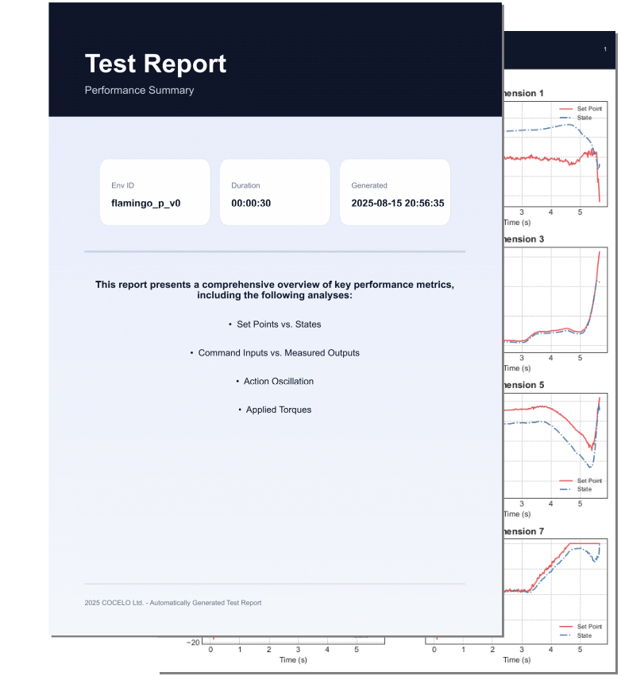

# cosim
**Sim-to-Sim Framework Using MuJoCo**

## Overview
<p align="center">
  
  
</p>

`cosim` is a **Sim-to-Sim Framework** built on the MuJoCo physics engine.  
It is designed to study transitions between different simulation environments and evaluate model performance under varying physical and sensory conditions.

## Key Features

- **📌 MuJoCo-Powered Simulation**  
  High-performance, physics-based simulation for precise and realistic modeling.

- **🔁 Cross-Environment Transfer**  
  Supports transfer learning and benchmarking across different physical configurations and terrains.

- **📈 Comprehensive Analysis Tools**  
  Automatically generates detailed reports for policy evaluation and performance analysis.

- **⚙️ Configurable Physical Properties**  
  - Sliding, rolling, and torsional friction  
  - Mass noise, load variance  
  - Action delay probability  
  - Actuator gains (Kp/Kd for hip, shoulder, leg, wheel)
  - ... and more!

- **🌐 Diverse Terrain Support**  
  Includes predefined environments:  
  - `flat`, `rocky_easy`, `rocky_hard`  
  - `slope_easy`, `slope_hard`  
  - `stairs_up_easy`, `stairs_up_normal`, `stairs_up_hard`

- **🎮 Dual Command Modes**  
  - Velocity-based commands  
  - Position-based commands

- **🗺️ Height Map Integration**  
  Real-time terrain visualization with adjustable map size and resolution.

- **🧩 Modular User Interface**  
  - Environment & policy configuration  
  - Hardware tuning  
  - Key-based command input  
  - Sensor noise and randomization settings

## Installation

### 1. Create a Conda Environment (Python 3.10 recommended)

```bash
conda create -n cosim python=3.10
conda activate cosim
```

### 2. Install Dependencies
```bash
pip install -r requirements.txt
```

### 3. Run the Simulator
```bash
python launch.py
```

## Project Structure
```
cosim/
├── core/                 # Policy interface and testing logic
├── envs/                 # Environment wrapper and simulation backend
├── config/               # YAML configuration files
├── docs/                 # docs
├── gui/                  # Main PyQt5-based user interface
├── launch.py             # Entry point to run GUI
└── README.md
```
